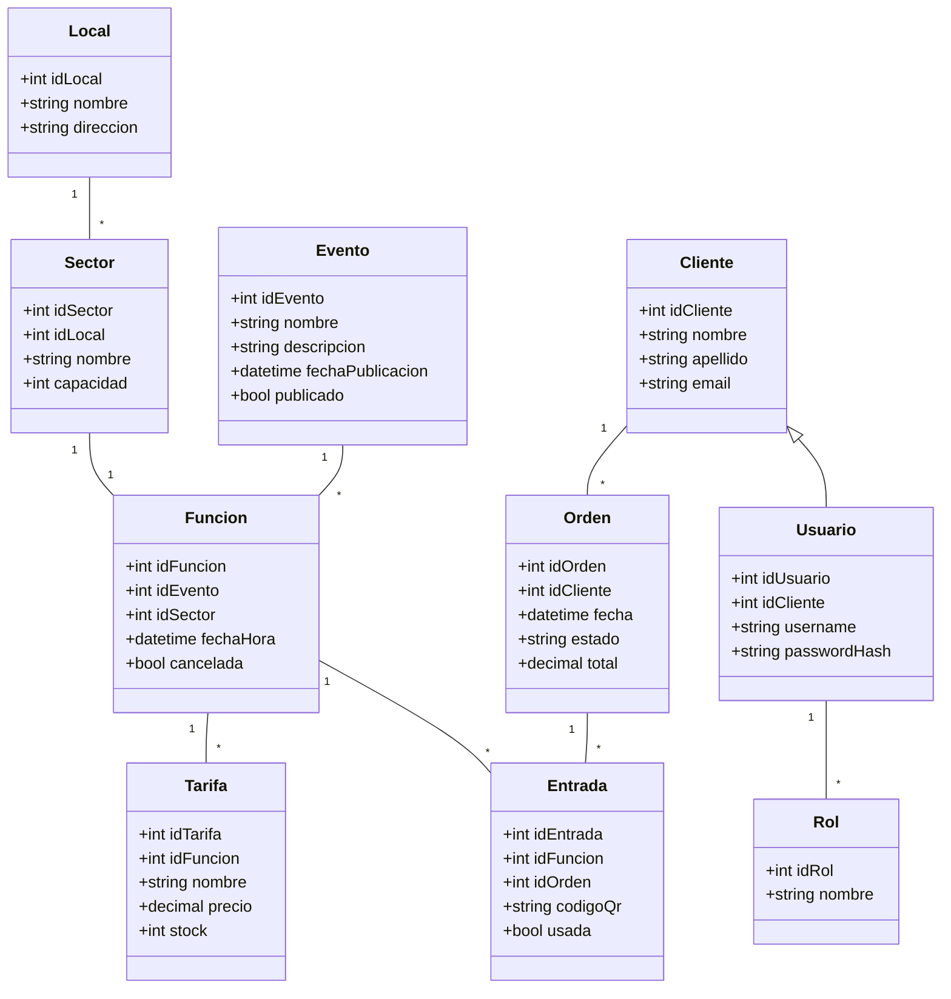
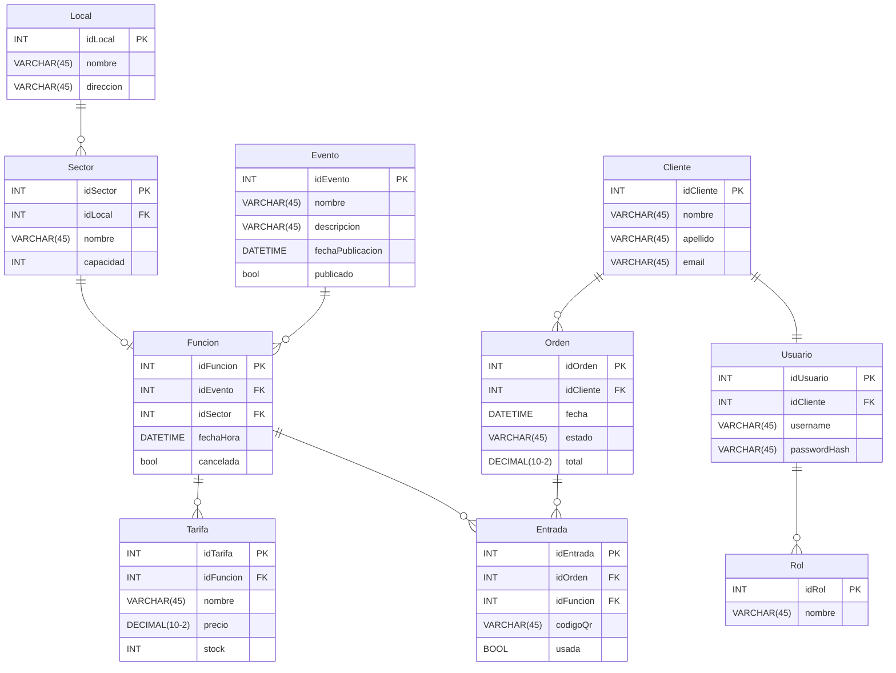

```mermaid
classDiagram
    class Local {
        +int idLocal
        +string nombre
        +string direccion
    }

    class Sector {
        +int idSector
        +int idLocal
        +string nombre
        +int capacidad
    }

    class Evento {
        +int idEvento
        +string nombre
        +string descripcion
        +datetime fechaPublicacion
        +bool publicado
    }

    class Funcion {
        +int idFuncion
        +int idEvento
        +int idSector
        +datetime fechaHora
        +bool cancelada
    }

    class Tarifa {
        +int idTarifa
        +int idFuncion
        +string nombre
        +decimal precio
        +int stock
    }

    class Cliente {
        +int idCliente
        +string nombre
        +string apellido
        +string email
    }

    class Orden {
        +int idOrden
        +int idCliente
        +datetime fecha
        +string estado
        +decimal total
    }

    class Entrada {
        +int idEntrada
        +int idFuncion
        +int idOrden
        +string codigoQr
        +bool usada
    }

    class Usuario {
        +int idUsuario
        +int idCliente
        +string username
        +string passwordHash
    }

    class Rol {
        +int idRol
        +string nombre
    }

    %% Relaciones
    Local "1" -- "*" Sector
    Sector "1" -- "1" Funcion 
    Evento "1" -- "*" Funcion 
    Funcion "1" -- "*" Tarifa 
    Cliente "1" -- "*" Orden 
    Orden "1" -- "*" Entrada
    Funcion "1" -- "*" Entrada 
    Usuario "1" -- "*" Rol
    Cliente <|-- Usuario
```

```mermaid
erDiagram
    Local {
        INT idLocal PK
        VARCHAR(45) nombre
        VARCHAR(45) direccion
    }

    Sector {
        INT idSector PK
        INT idLocal FK
        VARCHAR(45) nombre
        INT capacidad
    }

    Evento {
        INT idEvento PK
        VARCHAR(45) nombre
        VARCHAR(45) descripcion
        DATETIME fechaPublicacion
        bool publicado
    }

    Funcion {
        INT idFuncion PK
        INT idEvento FK
        INT idSector FK
        DATETIME fechaHora
        bool cancelada
    }

    Tarifa {
        INT idTarifa PK
        INT idFuncion FK
        VARCHAR(45) nombre
        DECIMAL(10-2) precio
        INT stock
    }

    Cliente {
        INT idCliente PK
        VARCHAR(45) nombre
        VARCHAR(45) apellido
        VARCHAR(45) email
    }

    Orden {
        INT idOrden PK
        INT idCliente FK
        DATETIME fecha
        VARCHAR(45) estado
        DECIMAL(10-2) total
    }

    Entrada {
        INT idEntrada PK
        INT idOrden FK
        INT idFuncion FK
        VARCHAR(45) codigoQr
        BOOL usada
    }

    Usuario {
        INT idUsuario PK
        INT idCliente FK
        VARCHAR(45) username
        VARCHAR(45) passwordHash
    }

    Rol {
        INT idRol PK
        VARCHAR(45) nombre
    }

    %% Relaciones
    Local ||--o{ Sector : ""
    Sector ||--o| Funcion : ""
    Evento ||--o{ Funcion : ""
    Funcion ||--o{ Tarifa : ""
    Cliente ||--o{ Orden : ""
    Orden ||--o{ Entrada : ""
    Funcion ||--o{ Entrada : ""
    Usuario ||--o{ Rol : ""
    Cliente ||--|| Usuario : ""
```