# ***Documentacion Proyecto Plan de Estudio***

## **Diagrama de Clases:**

## **DER**

```mermaid 
erDiagram
    Local {
        INT idLocal PK
        VARCHAR(45) nombre
        VARCHAR(45) direccion
    }

    Sector {
        INT idSector PK
        INT idLocal FK
        VARCHAR(45) nombre
        INT capacidad
    }

    Evento {
        INT idEvento PK
        VARCHAR(45) nombre
        VARCHAR(45) descripcion
        DATETIME fechaPublicacion
        BOOL publicado
    }

    Funcion {
        INT idFuncion PK
        INT idEvento FK
        INT idSector FK
        DATETIME fechaHora
        bool cancelada
    }

    Tarifa {
        INT idTarifa PK
        INT idFuncion FK
        VARCHAR(45) nombre
        DECIMAL(10-2) precio
        INT stock
    }

    Cliente {
        INT DNI PK
        VARCHAR(45) nombre
        VARCHAR(45) apellido
        VARCHAR(45) email
    }

    Orden {
        INT idOrden PK
        INT DNI FK
        DATETIME fecha
        VARCHAR(45) estado
        DECIMAL(10-2) total
    }

    Entrada {
        INT idEntrada PK
        INT idOrden FK
        INT idFuncion FK
        VARCHAR(45) codigoQr
        BOOL usada
    }

    Usuario {
        INT idUsuario PK
        INT DNI FK
        VARCHAR(45) username
        VARCHAR(45) passwordHash
    }

    %% Relaciones
    Local ||--o{ Sector : ""
    Sector ||--o| Funcion : ""
    Evento ||--o{ Funcion : ""
    Funcion ||--o{ Tarifa : ""
    Cliente ||--o{ Orden : ""
    Orden ||--o{ Entrada : ""
    Funcion ||--o{ Entrada : ""
    Cliente ||--|| Usuario : ""
```

## **Tareas**

### **Lista de tareas**

| **Orden** | **Tarea**                         | **Duracion (hs)** | **Dependencias** |
|-------|---------------------------------------|:-------------:|:------------:|
|a  |Configurar el entorno de desarrollo        | 1             | -            |
|b	|Crear y preparar la base de datos	        | 2	            | a            |
|c	|Integrar validadores en la API	            | 2	            | a            |
|d	|Ejecutar las pruebas unitarias existentes	| 3	            | b, c         |
|e	|Probar autenticación y autorización JWT	| 2	            | d            |
|f	|Documentar la API y el proyecto	        | 2	            | d            |
|g	|Preparar el despliegue en producción	    | 3	            | e, f         |
|h	|Desplegar la aplicación	                | 2	            | g            |
|i	|Realizar pruebas de aceptación	            | 2	            | h            |
|j	|Cierre del proyecto	                    | 1	            | i            |

### **Gantt**

```mermaid
gantt
    title Proyecto: Boletería Digital
    dateFormat  HH
    axisFormat  %Hh
    section Preparación
    a : a, 00, 1h
    b : b, after a, 2h
    c : c, after a, 2h

    section Desarrollo y Pruebas
    d : d, after b c, 3h
    e : e, after d, 2h
    f : f, after d, 2h

    section Despliegue
    g : g, after e f, 3h
    h : h, after g, 2h

    section Finalización
    i : i, after h, 2h
    j : j, after i, 1h
```

