# Diagramas

### En este apartado se encuentran los distintos diagramas del proyecto, como tambien la lista de tareas implementada.

- [Casos de Uso](#casos-de-uso)
- [DER](#der)
- [Diagrama de clases](#diagrama-de-clases)
- [Tareas](#tareas)

---

## Casos de uso

---

## DER

~~~mermaid
erDiagram
    Usuario ||--o{ Cliente : "1 a 1"
    Cliente ||--o{ Orden : "1 a muchos"
    Orden ||--o{ Entrada : "1 a muchos"
    Entrada ||--|| Qr : "1 a 1"
    Local ||--o{ Sector : "1 a muchos"
    Evento ||--o{ Funcion : "1 a muchos"
    Funcion ||--o{ Tarifa : "1 a muchos"
    Sector ||--o{ Tarifa : "1 a muchos"
    Usuario ||--o{ RefreshTokens : "1 a muchos"
    Sector ||--o{ Orden : "1 a muchos"

    Usuario {
        int idUsuario PK
        varchar email
        varchar passwordHash
        int rol
    }
    Cliente {
        int idCliente PK
        int idUsuario FK
        int DNI
        varchar nombre
        varchar apellido
    }
    Orden {
        int idOrden PK
        int idCliente FK
        int idSector FK
        datetime fecha
        bool pagada
        bool cancelada
        decimal total
    }
    Entrada {
        int idEntrada PK
        int idOrden FK
        int idTarifa FK
        bool anulada
        bool usada
    }
    Qr {
        int idQr PK
        int idEntrada FK
        varchar url
    }
    Local {
        int idLocal PK
        varchar nombre
        varchar direccion
        bool eliminado
    }
    Evento {
        int idEvento PK
        varchar nombre
        varchar descripcion
        bool publicado
        bool cancelado
    }
    Funcion {
        int idFuncion PK
        int idEvento FK
        datetime fechaHora
        bool cancelada
    }
    Sector {
        int idSector PK
        int idLocal FK
        varchar nombre
        bool eliminado
    }
    Tarifa {
        int idTarifa PK
        int idFuncion FK
        int idSector FK
        decimal precio
        int stock
        bool activo
    }
    RefreshTokens {
        int idRefreshToken PK
        int idUsuario FK
        varchar refreshToken
        datetime emitido
        datetime expiracion
        bool revocado
    }
~~~

---

## Diagrama de clases

~~~mermaid
classDiagram
    class Usuario {
        +int idUsuario
        +string email
        +string passwordHash
        +int rol
    }
    class Cliente {
        +int idCliente
        +int idUsuario
        +int DNI
        +string nombre
        +string apellido
    }
    class Orden {
        +int idOrden
        +int idCliente
        +int idSector
        +DateTime fecha
        +bool pagada
        +bool cancelada
        +decimal total
    }
    class Entrada {
        +int idEntrada
        +int idOrden
        +int idTarifa
        +bool anulada
        +bool usada
    }
    class Qr {
        +int idQr
        +int idEntrada
        +string url
    }
    class Local {
        +int idLocal
        +string nombre
        +string direccion
        +bool eliminado
    }
    class Evento {
        +int idEvento
        +string nombre
        +string descripcion
        +bool publicado
        +bool cancelado
    }
    class Funcion {
        +int idFuncion
        +int idEvento
        +DateTime fechaHora
        +bool cancelada
    }
    class Sector {
        +int idSector
        +int idLocal
        +string nombre
        +bool eliminado
    }
    class Tarifa {
        +int idTarifa
        +int idFuncion
        +int idSector
        +decimal precio
        +int stock
        +bool activo
    }
    class RefreshTokens {
        +int idRefreshToken
        +int idUsuario
        +string refreshToken
        +DateTime emitido
        +DateTime expiracion
        +bool revocado
    }

    Usuario "1" -- "1" Cliente
    Cliente "1" -- "0..*" Orden
    Orden "1" -- "0..*" Entrada
    Entrada "1" -- "1" Qr
    Local "1" -- "0..*" Sector
    Evento "1" -- "0..*" Funcion
    Funcion "1" -- "0..*" Tarifa
    Sector "1" -- "0..*" Tarifa
    Usuario "1" -- "0..*" RefreshTokens
    Sector "1" -- "0..*" Orden
~~~

---

## **Tareas**

### **Lista de tareas**

| **Orden** | **Tarea**                             | **Duracion (hs)** | **Dependencias** |
|-------|-------------------------------------------|:-------------:|:------------:|
|a  |Evaluar requerimientos                         | 5             | -            |
|b	|Realizar el DER y diagrama de clases	        | 4	            | a            |
|c	|Realizar el DDL y USERS                        | 7	            | b            |
|d	|Realizar capa Core	                            | 10	            | c            |
|e	|Realizar capa Dapper	                        | 6	            | d            |
|f	|Realizar capa Servicios	                    | 7	            | e            |
|g	|Investigar sobre JWT e implementarlo	        | 4	            | f            |
|h	|Habilitar la validacion por JWT en el Swagger  | 2	            | g            |
|i	|Realizar tests xUnit	                        | 5	            | f            |
|j	|Documentacion	                                | 3	            | i, h         |

### **Gantt**

```mermaid
gantt
    title Proyecto: Boletería Digital
    dateFormat  HH
    axisFormat  %Hh

    section Preparación
    a : a, 00, 5h
    b : b, after a, 4h
    c : c, after b, 7h

    section Desarrollo
    d : d, after c, 10h
    e : e, after d, 6h
    f : f, after e, 7h

    section Seguridad
    g : g, after f, 4h
    h : h, after g, 2h

    section Pruebas y Documentación
    i : i, after f, 5h
    j : j, after i h, 3h
```

