# ***Documentacion Proyecto Plan de Estudio***

## **Principios SOLID y POO orientada a objetos**

### ¿Qué es el principio SOLID?
~~~bash
S — Single Responsibility Principle (SRP)
Cada clase debe tener una única responsabilidad o motivo de cambio. 
Esto evita que una clase haga demasiadas cosas y se vuelva difícil de mantener.

O — Open/Closed Principle (OCP)
Las entidades de software (clases, módulos, funciones) 
deben estar abiertas a la extensión pero cerradas a la modificación. 
Es decir, se debe poder agregar funcionalidad sin modificar el código existente.

L — Liskov Substitution Principle (LSP)
Las subclases deben ser sustituibles por sus superclases sin 
romper el comportamiento del programa. Esto garantiza que el 
polimorfismo funcione correctamente.

I — Interface Segregation Principle (ISP)
Las interfaces deben ser específicas y pequeñas, no generales. 
Es mejor tener varias interfaces enfocadas que una sola 
muy grande que obligue a implementar métodos innecesarios.

D — Dependency Inversion Principle (DIP)
Los módulos de alto nivel no deben depender de módulos de bajo nivel, 
ambos deben depender de abstracciones (interfaces o clases abstractas). 
Esto reduce el acoplamiento y facilita los tests y la flexibilidad.
~~~

## **Arquitectura en capas**

### El proyecto sigue una arquitectura en capas que separa responsabilidades
- ### La capa Core (dominio) contiene las clases de entidades, interfaces de repositorios y servicios, así como validadores de reglas de negocio, sin referencias a infraestructura
- ### La capa Dapper (infraestructura) implementa esos repositorios usando ADO.NET y Dapper (micro-ORM). 
- ### La capa Services implementa la lógica de negocio coordinando las operaciones entre servicios y repositorios. 
- ### La capa API contiene los controladores ASP.NET Core y la configuración del pipeline (inyección de dependencias, autenticación JWT, Swagger, etc.). 
- ### La capa Tests incluye las pruebas unitarias. Gracias a esta separación, las capas internas definen interfaces y las implementaciones concretas se inyectan en tiempo de ejecución (Principio de Inversión de Dependencias).

## **Persistencia de datos con Dapper y patrón Repositorio**

### La persistencia se realiza con Dapper, un micro-ORM ligero y de alto rendimiento para .NET
- ### Dapper permite ejecutar consultas SQL directamente y mapear resultados a objetos C#. Cada entidad principal tiene un repositorio específico (por ejemplo RepoEvento, RepoOrden) que implementa interfaces definidas en Core. El uso del patrón Repositorio separa la lógica de acceso a datos de la lógica de negocio, facilitando la inyección de dependencias y las pruebas unitarias.

## **Autenticación y autorización con JWT**

### Para seguridad se implementa JWT (JSON Web Token) en la API
- ### Al iniciar sesión, el servidor emite un token firmado que el cliente incluye en el encabezado Authorization: Bearer <token> en cada petición. ASP.NET Core valida este token en cada endpoint, extrayendo la identidad del usuario a partir de las claims. Se gestionan roles (Administrador, Organizador, Cliente, Default) para autorizar permisos. 
### Los endpoints de autenticación son /auth/register, /auth/login, /auth/refresh, /auth/logout, /auth/me y otros para gestión de roles de usuarios.

## **Endpoints principales de la API REST**

### Se exponen recursos RESTful con respuestas JSON y códigos HTTP estándar (200, 201, 204, 400, 401, 403, 404). Los endpoints cubren CRUD(Create, Read, Update, Delete) para cada entidad clave y operaciones específicas:

- ### Locales: POST /locales, GET /locales, GET /locales/{id}, PUT /locales/{id}, DELETE /locales/{id}.

- ### Sectores: POST /locales/{id}/sectores, GET /locales/{id}/sectores, PUT /sectores/{id}, DELETE /sectores/{id}.

- ### Eventos: POST /eventos, GET /eventos, GET /eventos/{id}, PUT /eventos/{id}, POST /eventos/{id}/publicar, POST /eventos/{id}/cancelar.

- ### Funciones: POST /funciones, GET /funciones, GET /funciones/{id}, PUT /funciones/{id}, POST /funciones/{id}/cancelar.

- ### Tarifas: POST /tarifas, GET /funciones/{id}/tarifas, PUT /tarifas/{id}, GET /tarifas/{id}.

- ### Clientes: POST /clientes, GET /clientes, GET /clientes/{id}, PUT /clientes/{id}.

- ### Órdenes de Compra: POST /ordenes, GET /ordenes, GET /ordenes/{id}, POST /ordenes/{id}/pagar, POST /ordenes/{id}/cancelar.

- ### Entradas (Tickets): GET /entradas, GET /entradas/{id}, POST /entradas/{id}/anular.

- ### Usuarios y autenticación: POST /auth/register, POST /auth/login, POST /auth/refresh, POST /auth/logout, GET /auth/me, GET /auth/roles, POST /usuarios/{id}/roles.

- ### Códigos QR: GET /entradas/{id}/qr (genera código QR para la entrada); POST /qr/validar (valida un QR escaneado).

### Estos endpoints siguen convenciones REST y pueden probarse fácilmente usando Swagger UI

## **Pruebas unitarias y Moq**

### Hay un proyecto de pruebas (xUnit) que verifica la lógica de negocio y de acceso a datos. Se definen casos de prueba claros siguiendo buenas prácticas de nomenclatura. Para simular dependencias externas (como llamadas a la base de datos), se usa Moq, un framework de simulación de objetos open-source muy popular en .NET
- ### Moq permite crear mocks de repositorios y servicios, verificando que las capas superiores actúen según lo esperado sin tocar recursos reales.

## **Documentación con Swagger**

### Se integra Swagger/OpenAPI (mediante Swashbuckle) para generar documentación interactiva de la API. Swagger UI provee una interfaz web que muestra todos los endpoints definidos en la aplicación.
- ### Cada acción pública en los controladores es accesible y ejecutable desde esa interfaz, lo que permite agregar parámetros y probar el método directamente con “Try it out!”
- ### Esto agiliza el desarrollo y la validación. En Program.cs también se configura la lectura de parámetros (appsettings, cadenas de conexión) y se registra la inyección de dependencias necesaria.

## **Generación y validación de códigos QR**

### La generación de códigos QR se maneja con la librería QRCoder para .NET
- ### Al procesar una orden de compra pagada, se emite un código QR único por cada entrada (en formato PNG/Base64) que incluye los datos firmados. El endpoint de validación (POST /qr/validar) verifica la firma y el estado de la entrada, devolviendo resultados como Ok, YaUsada, Expirada, FirmaInvalida o NoExiste según las reglas de negocio definidas en la consigna.

## **Tareas**

### **Lista de tareas**

| **Orden** | **Tarea**                             | **Duracion (hs)** | **Dependencias** |
|-------|-------------------------------------------|:-------------:|:------------:|
|a  |Evaluar requerimientos                         | 2             | -            |
|b	|Realizar el DER y diagrama de clases	        | 2	            | a            |
|c	|Realizar el DDL y USERS                        | 3	            | b            |
|d	|Realizar capa Core	                            | 4	            | c            |
|e	|Realizar capa Dapper	                        | 4	            | d            |
|f	|Realizar capa Servicios	                    | 6	            | e            |
|g	|Investigar sobre JWT e implementarlo	        | 1	            | f            |
|h	|Habilitar la validacion por JWT en el Swagger  | 1	            | g            |
|i	|Realizar tests xUnit	                        | 4	            | f            |
|j	|Documentacion	                                | 2	            | i, h         |

### **Gantt**

```mermaid
gantt
    title Proyecto: Boletería Digital
    dateFormat  HH
    axisFormat  %Hh

    section Preparación
    a : a, 00, 2h
    b : b, after a, 2h
    c : c, after b, 3h

    section Desarrollo
    d : d, after c, 4h
    e : e, after d, 4h
    f : f, after e, 6h

    section Seguridad
    g : g, after f, 1h
    h : h, after g, 1h

    section Pruebas y Documentación
    i : i, after f, 4h
    j : j, after i h, 2h
```

