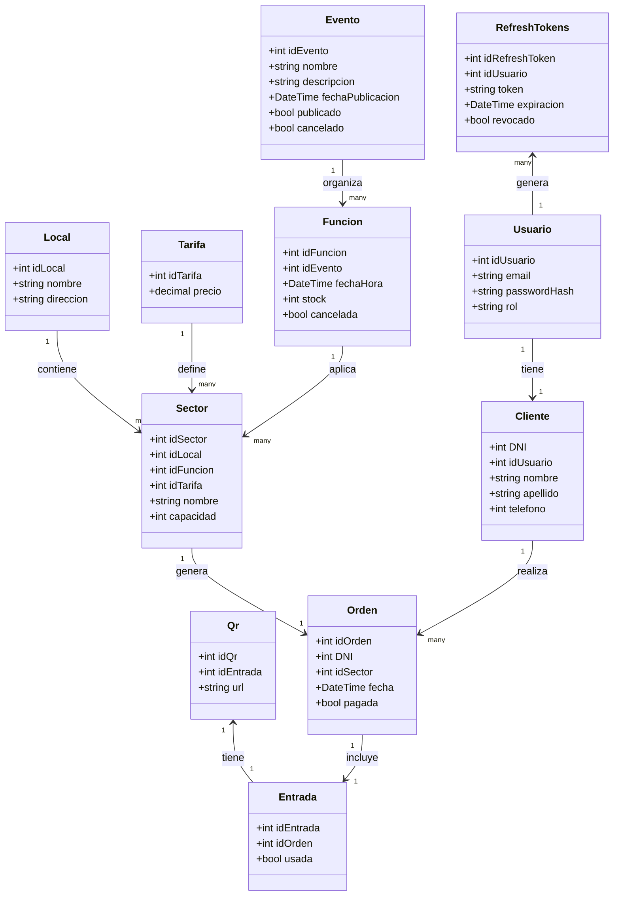
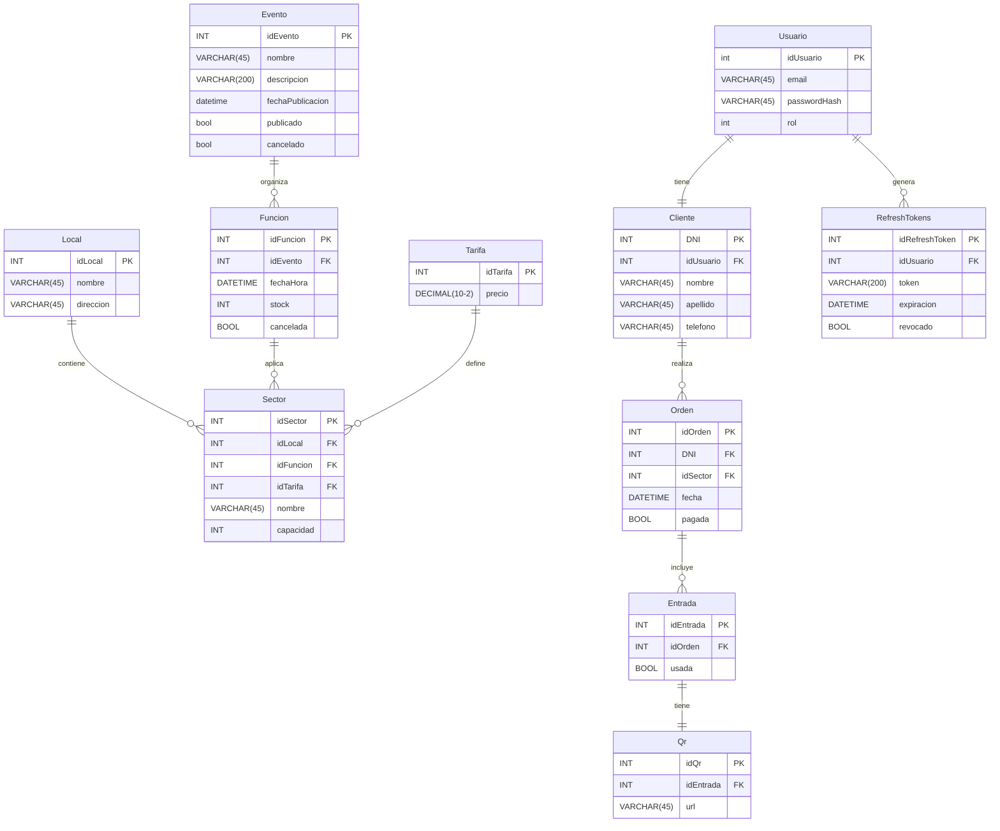

## **Diagrama de Clases:**

```mermaid
classDiagram
    class Local {
        +int idLocal
        +string nombre
        +string direccion
    }

    class Evento {
        +int idEvento
        +string nombre
        +string descripcion
        +DateTime fechaPublicacion
        +bool publicado
        +bool cancelado
    }

    class Funcion {
        +int idFuncion
        +int idEvento
        +DateTime fechaHora
        +int stock
        +bool cancelada
    }

    class Sector {
        +int idSector
        +int idLocal
        +int idFuncion
        +int idTarifa
        +string nombre
        +int capacidad
    }

    class Tarifa {
        +int idTarifa
        +decimal precio
    }

    class Usuario {
        +int idUsuario
        +string email
        +string passwordHash
        +string rol
    }

    class Cliente {
        +int DNI
        +int idUsuario
        +string nombre
        +string apellido
        +int telefono
    }

    class RefreshTokens {
        +int idRefreshToken
        +int idUsuario
        +string token
        +DateTime expiracion
        +bool revocado
    }

    class Orden {
        +int idOrden
        +int DNI
        +int idSector
        +DateTime fecha
        +bool pagada
    }

    class Entrada {
        +int idEntrada
        +int idOrden
        +bool usada
    }

    class Qr {
        +int idQr
        +int idEntrada
        +string url
    }

    %% RELACIONES
    Local "1" --> "many" Sector : contiene
    Tarifa "1" --> "many" Sector : define
    Funcion "1" --> "many" Sector : aplica
    Evento "1" --> "many" Funcion : organiza
    Sector "1" --> "1" Orden : genera
    Qr "1" <-- "1" Entrada : tiene
    Cliente "1" --> "many" Orden : realiza
    Orden "1" --> "1" Entrada : incluye
    Usuario "1" --> "1" Cliente : tiene
    RefreshTokens "many" <-- "1" Usuario : genera
```

## **DER**

```mermaid
erDiagram
    Local ||--o{ Sector : contiene
    Evento ||--o{ Funcion : organiza
    Funcion ||--o{ Sector : aplica
    Tarifa ||--o{ Sector : define
    Cliente ||--o{ Orden : realiza
    Orden ||--o{ Entrada : incluye
    Entrada ||--|| Qr : tiene
    Usuario ||--|| Cliente : tiene
    Usuario ||--o{ RefreshTokens : genera

    Local {
        INT idLocal PK
        VARCHAR(45) nombre
        VARCHAR(45) direccion
    }

    Evento {
        INT idEvento PK
        VARCHAR(45) nombre
        VARCHAR(200) descripcion
        datetime fechaPublicacion
        bool publicado
        bool cancelado
    }

    Funcion {
        INT idFuncion PK
        INT idEvento FK
        DATETIME fechaHora
        INT stock
        BOOL cancelada
    }

    Tarifa {
        INT idTarifa PK
        DECIMAL(10-2) precio
    }

    Sector {
        INT idSector PK
        INT idLocal FK
        INT idFuncion FK
        INT idTarifa FK
        VARCHAR(45) nombre
        INT capacidad
    }

    Usuario {
        int idUsuario PK
        VARCHAR(45) email
        VARCHAR(45) passwordHash
        int rol
    }

    Cliente {
        INT DNI PK
        INT idUsuario FK
        VARCHAR(45) nombre
        VARCHAR(45) apellido
        VARCHAR(45) telefono
    }

    RefreshTokens {
        INT idRefreshToken PK
        INT idUsuario FK
        VARCHAR(200) token
        DATETIME expiracion
        BOOL revocado
    }

    Orden {
        INT idOrden PK
        INT DNI FK
        INT idSector FK
        DATETIME fecha
        BOOL pagada
    }

    Entrada {
        INT idEntrada PK
        INT idOrden FK
        BOOL usada
    }

    Qr {
        INT idQr PK
        INT idEntrada FK
        VARCHAR(45) url
    }
```